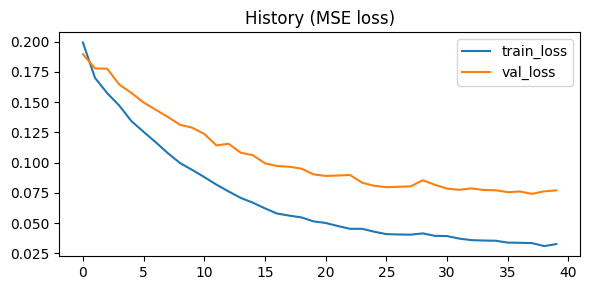
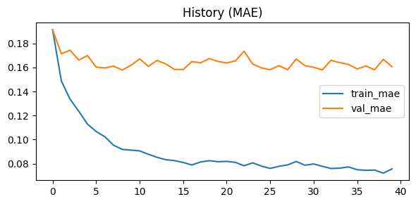

# Сборный проект-5

Вам поручено разработать демонстрационную версию поиска изображений по запросу.

Для демонстрационной версии нужно обучить модель, которая получит векторное представление изображения, векторное представление текста, а на выходе выдаст число от 0 до 1 — покажет, насколько текст и картинка подходят друг другу.

## Ссылка на ноутбук с решением

**Ссылка на ноутбук с решением: [solution.ipynb](solution.ipynb)**

```bash
Simple MLP MAE : 0.1581
Simple MLP MSE : 0.0531
Simple MLP RMSE: 0.2304
Simple MLP R2  : 0.3593
```

#### Метрики модели:





## Результаты разработки PoC для поиска изображений

**Цель проекта:** Разработать и обучить демонстрационную модель, которая оценивает семантическую близость между изображением и текстовым запросом, возвращая значение от 0 до 1.

**Архитектура решения:**
- **Векторизация изображений:** Использована предобученная модель **ResNet50**.
- **Векторизация текста:** Использована модель **distilbert-base-uncased**.
- **Модель оценки:** Обучен **многослойный перцептрон (MLP)** на объединённых векторных представлениях для предсказания оценки схожести.

**Обучение и оценка:**
- В качестве целевой переменной использовались оценки экспертов (`expert`: 5822 примера).
- Проведено сравнение с Dummy-моделью и базовой нейросетью.
- Итоговая MLP-модель показала наилучшее качество на валидации.

**Ключевые метрики (Simple MLP):**
- **MAE:** 0.1581
- **R²:** 0.3593
- **Прирост MAE** по сравнению с Dummy-моделью: **0.0688**

**Выводы и наблюдения:**
- Разработанный PoC показывает низкую стабильность в предоставлении релевантных результатов. Лишь в редких случаях в поисковую выдачу попадает полностью соответствующее изображение.
- Наиболее предсказуемые результаты модель демонстрирует на часто встречающихся в запросах объектах, например, **собаках** (слово `dog` — самое частотное).
- Вероятная причина низкой точности — **недостаточный объём данных** для обучения (`train_dataset`: 5822 примера). Модели не хватает разнообразия для выявления сложных семантических связей.
- Возможно стоит попробовать использовать также CrowdAnnotations для улучшения результата поиска
- Для улучшения качества рекомендуется **существенное увеличение объёма обучающей выборки** и, возможно, использование более сложных архитектур для объединения модальностей.